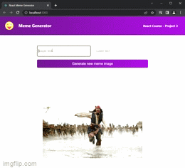

# Meme Generator with React Hooks

## App Information

### Title: Meme Generator - Scrimba Project

### Description

This app showcases a basic meme generator using React hooks useState and useEffect. It consist on making an API a call on the initial render, and update the meme the state of the meme object every time I changed the texts and the meme image. 

The meme image is extracted from the allMemes array that was initially set in the API call. Every time the button is clicked, we get a random url from the array, and sets it to the randomImage key in the meme object.

### How to Run

Simply download the zip folder with the source code file, or fork it into your github and clone it into your machine, and install all the dependencies.

### Author

Kevin Grimaldi.
Student at MIT - Full Stack Development with MERN
Meme Generator Project from ***[Scrimba - Learn React for Free](https://scrimba.com/allcourses)

### License

MIT License
